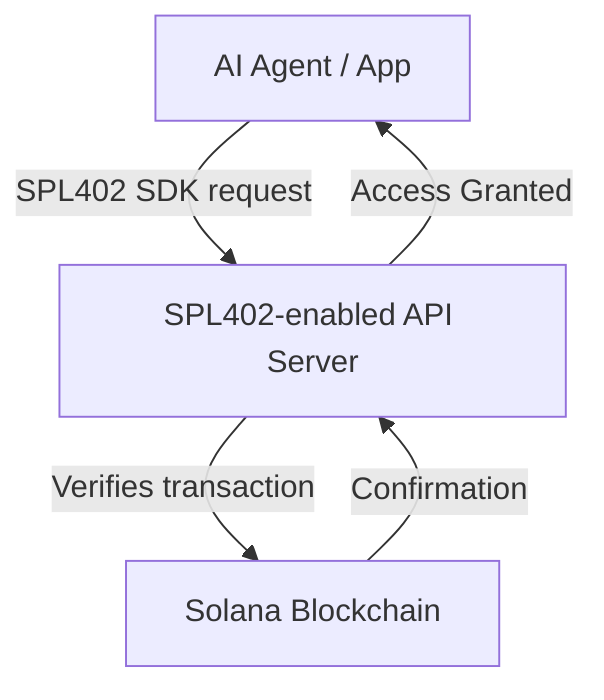
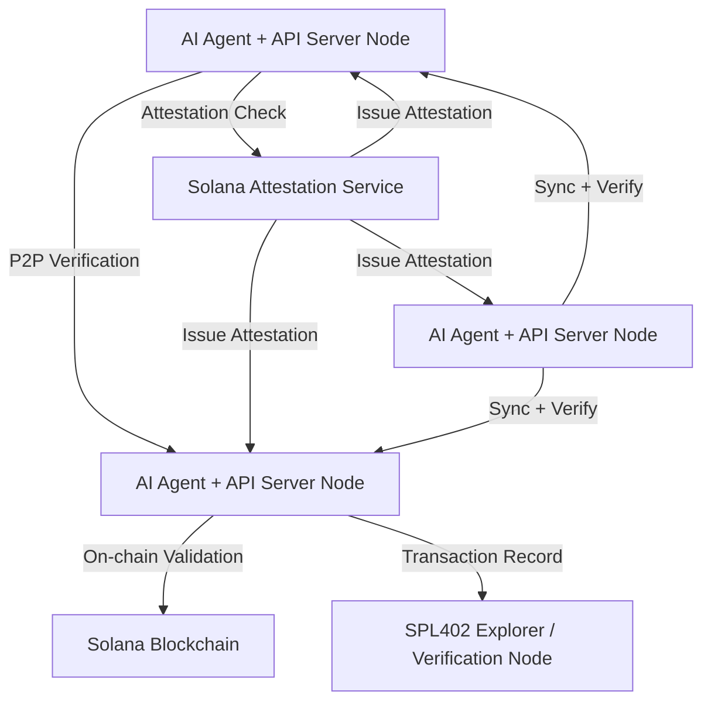

# SPL402 Whitepaper

**Title:** SPL402: Decentralized Payment Protocol for AI Agents and APIs

**Author:** AstrohackerX [Github](https://github.com/astrohackerx)

**Website:** [spl402.org](https://spl402.org) | [x.com/spl402](https://x.com/spl402)  
**Network:** Solana mainnet-beta  
**Governance:** SPL402 Token (Mint: DXgxW5ESEpvTA194VJZRxwXADRuZKPoeadLoK7o5pump)

---

## Executive Summary

SPL402 is a Solana-native decentralized payment and verification protocol designed for AI agents, API services, and automated data systems. It represents the next generation of x402 — replacing centralized, intermediary-based payments with fully on-chain Solana transactions. 

By leveraging Solana’s performance and the Solana Attestation Service (SAS), SPL402 enables **trustless, verifiable, and decentralized payments and identity verification** between AI agents and APIs. It is designed for developers building scalable, censorship-resistant, and economically efficient API and AI agent ecosystems.

---

## Motivation

Centralized payment solutions like x402 introduce significant limitations:

- **Single point of failure:** Central entities can throttle or block access.  
- **Middleman dependency:** Reliance on intermediaries like Coinbase adds friction and fees.  
- **Opaque transactions:** Lack of on-chain auditability for developers and agents.  

SPL402 eliminates these issues by providing **a decentralized, auditable, and permissionless on-chain protocol**.

---

## SPL402 Overview

- **Server SDK:** Enables any API server to verify SPL402 payments and control access automatically.  
- **Client SDK:** Used by AI agents or apps to initiate and verify transactions directly on-chain.  
- **Tokenized Payments:** Accepts SOL or any SPL token, enabling universal payment rails without banks.  
- **Solana Verification:** Every transaction is cryptographically validated on Solana, ensuring transparency and immutability.

---

## Architecture

- **Step 1:** Client sends a request to an API endpoint integrated with SPL402 SDK.  
- **Step 2:** Server checks if the client has paid in SPL402 tokens.  
- **Step 3:** Server verifies the transaction on Solana mainnet.  
- **Step 4:** Access is granted if payment is confirmed.

---

## Extended Network Diagram

**Workflow Explanation:**

1. Each AI Agent + API Server node acts as both consumer and provider.  
2. Nodes verify payments and identities through SAS attestations.  
3. P2P synchronization ensures network redundancy and decentralization.  
4. SPL402 Explorer displays verified servers, transactions, and attestations.  
5. Solana mainnet provides final settlement and audit trail.

---

## Transaction Lifecycle

1. **Wallet Connection:** AI Agent or user connects Solana wallet.  
2. **Payment Initiation:** SPL402 SDK triggers an on-chain transaction.  
3. **On-Chain Verification:** Solana validates the payment in real time.  
4. **Server Verification:** API Server SDK checks transaction and attestation status.  
5. **Access Granted:** Verified response or API data delivered to the client.

---

## Solana Attestation Service (SAS) Integration

SAS ensures decentralized, cryptographic trust for all participating servers:

- **Server Attestation:** Each API Server signs its identity using its Solana wallet and receives a SAS certificate.  
- **Automated Validation:** Clients and servers validate SAS attestations before exchanging data.  
- **Censorship Resistance:** No central registry or authority controls attestation issuance.

**Example:** An API server operator signs its server wallet → SAS provides attestation → SPL402 SDK recognizes it as verified → agent requests and payments are automatically authorized.

---

## Decentralized API Network Vision

- **Peer-to-Peer Topology:** All SPL402-enabled servers and agents form a decentralized mesh.  
- **Self-Verifying Network:** Attested nodes continuously verify peers’ authenticity.  
- **Open Discovery:** SPL402 Explorer displays real-time verified APIs, nodes, and payments.  
- **Censorship Resistance:** No centralized gatekeepers or dependency on external APIs.  
- **Scalability:** Network grows organically as each new node adds throughput and redundancy.

---

## Security and Verification Layer

- **On-Chain Payments:** Every transaction is immutable and auditable.  
- **Signature Validation:** SPL402 SDK enforces wallet and transaction authenticity.  
- **SAS Attestation:** Confirms identity of API providers and nodes.  
- **Optional Encryption Layer:** Enables secure SSL/TLS-style communication between agents and APIs.

---

## Token Utility (SPL402 Token)

- **Payment Medium:** Required for API tiers, subscription services, or agent interactions.  
- **Governance:** Token holders will propose and vote on protocol-level upgrades.  
- **Access Control:** SPL402 SDK validates token-based access and SAS verification automatically.

---

## Roadmap & Ecosystem

1. ✅ **Phase 1:** Mainnet deployment, SPL402 SDK launch for client/server.  
2. ✅ **Phase 2:** Starter Kit, GPT-420 AI Agent integration demo. AI Agent Marketplace.  
3. ✅ **Phase 3:** SAS-based automated server verification.  
4. 🆕 **Phase 4:** Decentralized P2P API network.  
5. 🆕 **Phase 5:** DAO governance and protocol expansion.  
6. 🆕 **Phase 6:** Ecosystem-wide adoption and interoperability.

---

## References

- SPL402 SDK: [npm](https://www.npmjs.com/package/spl402) | [GitHub](https://github.com/astrohackerx/spl402)  
- Solana Blockchain: [solana.com](https://solana.com/)  
- Solana Attestation Service (SAS): [docs.solana.com](https://docs.solana.com/developing/on-chain-programs/attestation)

---

**Contact:** SPL402 Labs  |  [spl402.org](https://spl402.org)  |  [x.com/spl402](https://x.com/spl402)
