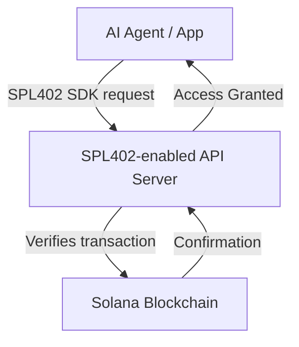

# SPL402 Whitepaper

**Title:** SPL402: Decentralized Payment Protocol for AI Agents and APIs

**Author:** Astrohacker\
**Website:** [spl402.org](https://spl402.org) | [x.com/spl402](https://x.com/spl402)\
**Network:** Solana mainnet-beta\
**Governance** SPL402 token (Mint: DXgxW5ESEpvTA194VJZRxwXADRuZKPoeadLoK7o5pump)

---

## Executive Summary

SPL402 is a Solana-native decentralized payment protocol designed for AI agents and API services. Unlike x402, which suffers from centralization and reliance on intermediaries like Coinbase, SPL402 enables direct on-chain payments verified via Solana signatures. It is open-source, fast, and developer-friendly, allowing AI service providers to integrate payment and access controls without relying on third-party payment processors.

## Motivation

Centralized API payment solutions, such as x402, face several critical limitations:

- **Single-point-of-failure**: A dominant platform can throttle or block payments.
- **Middleman dependency**: Intermediaries control transaction flow and take fees.
- **Limited decentralization**: Agents and developers cannot easily verify or audit transactions on-chain.

SPL402 addresses these by providing a **trustless, decentralized, and Solana-native protocol**.

## SPL402 Overview

- **Server SDK**: Integrates with any API server to verify SPL402 transactions and gate access.
- **Client SDK**: Integrated by AI agents or applications to initiate and confirm on-chain payments.
- **Tokenized payments**: Uses the SOL or any SPL token for transactions, enabling direct payment rails without credit cards or banks.
- **Solana verification**: All payments are verified with Solana signatures, ensuring security and transparency.

## Architecture

- **Step 1:** Client sends a request to an API endpoint integrated with SPL402 SDK.
- **Step 2:** Server checks if the client has paid in SPL402 tokens.
- **Step 3:** Server verifies the transaction on Solana mainnet.
- **Step 4:** Access is granted if payment is confirmed.

## Transaction Lifecycle

1. **Wallet connection**: Client connects Solana wallet.
2. **Payment initiation**: Client triggers payment via SPL402 SDK.
3. **On-chain confirmation**: Transaction recorded on Solana blockchain.
4. **Server verification**: Server SDK validates transaction.
5. **Access provisioned**: API response delivered.

## Solana Attestation Service (SAS) Integration

SAS provides trustable attestations:

- **Server attestation**: Each SPL402 server can obtain a wallet-backed attestation proving authenticity.
- **Automatic validation**: Servers periodically check attestation before granting access.
- **Decentralized trust**: Reduces reliance on a central authority.

**Use Case Example:** Admin clicks "Attest Server" → signs with wallet → server receives SAS attestation → SDK enforces only attested servers respond to client requests.

## Decentralized API Network Vision

- **Peer-to-peer server connections**: SPL402 servers can communicate and verify each other.
- **Verified online network**: Clients and developers can query which servers are authenticated.
- **Censorship resistance**: No single entity controls access or payments.
- **Scalability**: Each server contributes to network throughput.

## Security & Verification Layer

- All SPL402 payments are **on-chain**, eliminating middleman risk.
- Servers enforce **wallet verification** and **transaction signature checks**.
- Future SAS integration ensures server authenticity and auditability.

## Token Utility (SPL402 Token)

- **Payment medium**: Required for premium API tiers.
- **Governance** (future): Token holders can vote on network upgrades.
- **Access control**: Server SDK enforces payment and attestation verification.

## Roadmap & Ecosystem

1. ✅ **Phase 1:** Mainnet deployment, SDK integration with client & server.
2. ✅ **Phase 2:** Create Starter Kit. Deploy for demonstration AI Agents Marketplace, GPT-420 AI Agent. API Data App template.
3. 🆕**Phase 2:** SAS attestation support for automated server verification.
4. 🆕**Phase 3:** Decentralized API network with P2P verification.
5. 🆕**Phase 4:** DAO governance
6. 🆕**Phase 5:** Ecosystem expansion.

## References

- SPL402 SDK: [npm](https://www.npmjs.com/package/spl402) | [GitHub](https://github.com/astrohackerx/spl402)
- Solana Blockchain: [solana.com](https://solana.com/)
- Solana Attestation Service (SAS): [docs.solana.com](https://docs.solana.com/developing/on-chain-programs/attestation)

---

**Contact:** SPL402 Labs | [spl402.org](https://spl402.org) | [x.com/spl402](https://x.com/spl402)
